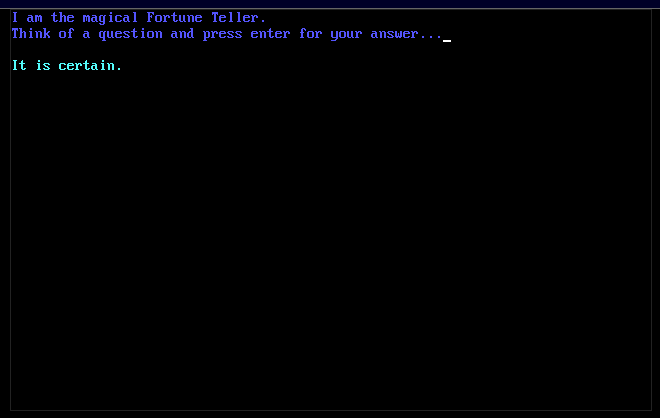

# Fortune Teller (My First Program ✨)

This is my **very first programming project**, written when I was a small child.  

It’s a magical little **fortune teller** written in [QBASIC](https://en.wikipedia.org/wiki/QBasic).  

I’ve kept it here as a piece of personal history 💙 — simple, colorful, and full of childhood wonder.



---

## How it works
- Clears the screen  
- Prompts you to think of a question  
- Picks a random answer from a small set of fortunes  
- Displays it in vibrant colors  

Every run gives you a new "mystical" response.

---

## Run it yourself

You can run it today using [QB64](https://www.qb64.dev/), a modern compiler for QBasic:

```bash
qb64 fortune_teller.bas
````

Then launch the generated executable to see the magic ✨ 

Or you can learn it on online emulators like [QBjs](https://qbjs.org/)

---

## License

Released under the MIT License.  
Free to use, share, and tinker with — just remember it started as a child’s first spark of code ❤️


